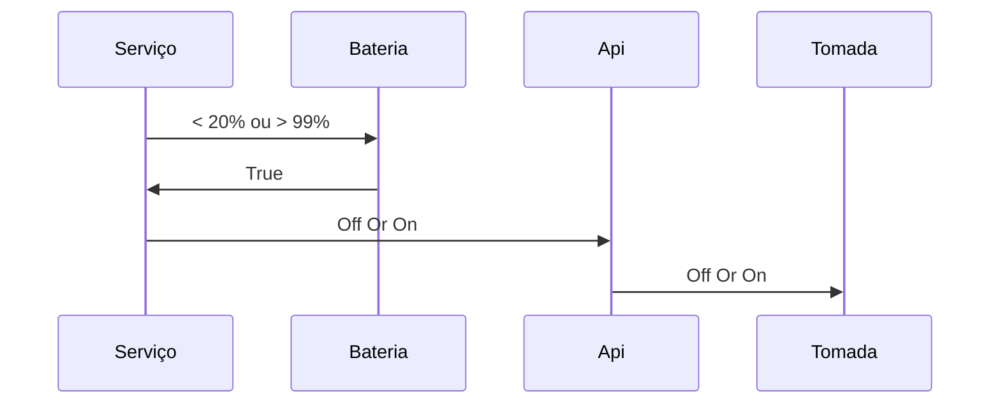

# HomeAssistant

## Objective
Maximize the battery life of the notebook by turning the charger off and on as the user prefers.
## Technology

 - C#
 - Windows Services

## Flow

# HomeAssistant
## Objetivo
Maximizar o tempo de vida da bateria do notebook, desligando e ligando o carregador conforme preferencia do usuário.

## Tecnologia usadas no Projeto

 - C#
 - Windows Services

## Fluxo 

# Referencias
https://github.com/ndg63276/smartlife/blob/master/functions.js

https://github.com/codetheweb/tuyapi/issues/20

https://e.tuya.com/smartlife

https://forum.homeassistantbrasil.com.br/t/integracao-tuya/1710

https://www.home-assistant.io/cookbook/

https://github.com/search?q=topic%3Ahome-assistant-config&type=Repositories

https://github.com/anirudhmvsk/smart-home-automation/blob/75202c698c1081287ca5d746528e0592c70f4c10/smartlife/index.js

https://docs.microsoft.com/pt-br/windows/uwp/devices-sensors/get-battery-info

https://developer.tuya.com/en/docs/iot/open-api/api-list/api?id=K989ru6gtvspg

https://developers.home-assistant.io/docs/development_index/

https://github.com/luisllamasbinaburo/SmartLifeNet/blob/434c27c21f692964d41e06f54457ca0549ed9055/SmartLifeNet/API/Rest.cs
